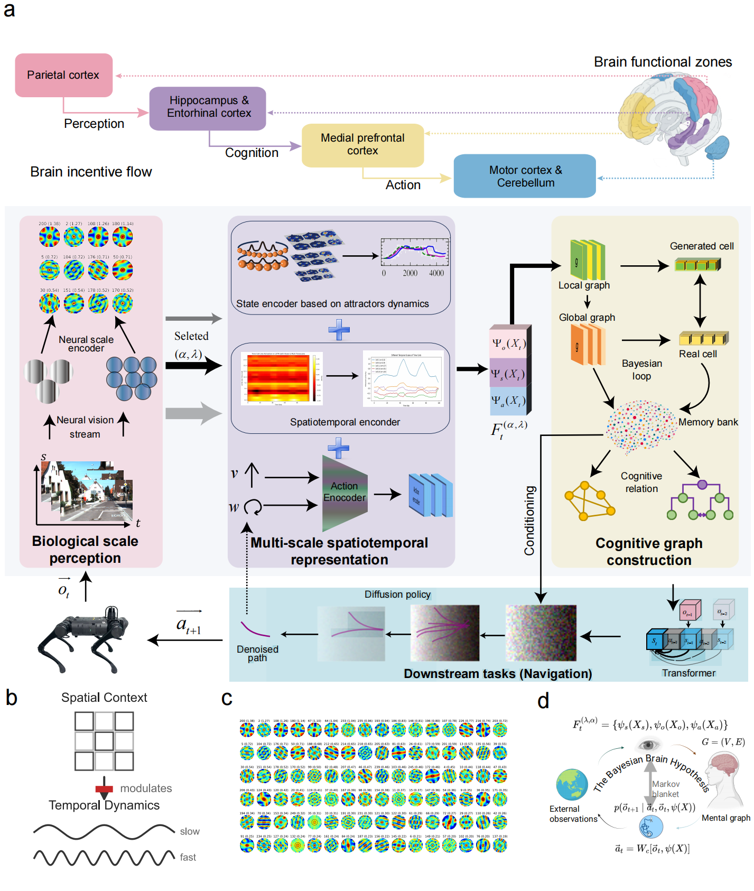

# A Brain-Inspired World Model for Embodied Navigation via Multi-Scale Spatiotemporal Graphs

[](https://opensource.org/licenses/MIT)
[](https://www.python.org/downloads/)
[](#) 

This repository contains the official, self-contained implementation of the Brain-Inspired World Model (BIW) described in our *Nature Communications* submission: **"A Brain-Inspired World Model for Embodied Navigation via Multi-Scale Spatiotemporal Graphs"**.



> **📝 Note to Reviewers:** > To facilitate a seamless peer-review process, we have fully integrated the vision transformer backbone (previously maintained as a separate module) directly into this repository under `biw_nav/perception/big_vistrans`. **This repository is completely self-contained; you do not need to clone any additional external repositories.**

---

## 1. System Requirements

We recommend running this code on a Linux machine with a discrete GPU for optimal performance, though the minimal working example (inference) can be executed on lower-tier hardware.

- **OS:** Ubuntu 20.04 LTS (Tested and Recommended)
- **CPU:** Intel Core i7 / AMD Ryzen 7 or equivalent
- **GPU:** NVIDIA GPU with at least 12GB VRAM (e.g., RTX 3060/3080) for inference. (12GB+ recommended for full evaluation and 80GB+ recommended for training).
- **Python:** >= 3.10
- **CUDA:** >= 12.0 (if using GPU acceleration)

---

## 2. Quick Installation (approx. 20-30 minutes)

We have streamlined the dependencies to ensure out-of-the-box reproducibility. 

```bash
# 1. Clone this repository
git clone [https://github.com/offroadmsp/BIW-Nav.git](https://github.com/offroadmsp/BIW-Nav.git)
cd BIW-Nav

# 2. Create and activate a Conda virtual environment
conda create -n biw_nav python=3.10 -y
conda activate biw_nav

# 3. Install required dependencies
pip install -r requirements.txt
```

## 3. Minimal Working Example (Demo for Reviewers)
As per the journal's reproducible research guidelines, we provide a Minimal Working Example (MWE) and sample data to instantly test the BIW model's multi-scale graph construction and inference capabilities.

### Step 1: Download the Sample Weights and Data
Please download the required .zip files from our repository:
🔗 Download Data & Weights ([Google Drive](https://drive.google.com/drive/folders/1BSeoyu8o_eRbBXeP93l81EQt_PJUlkHz?usp=sharing))

To quickly run the experiment, download data.zip and results.zip and extract them directly into the root BIW-Nav folder. The go_stanford.zip file contains additional data. Ensure the resulting file structure looks like this:

```Plaintext
BIW-Nav/
├── results/
│   └── **.pt      # Pre-trained model weights
├── data/
│   └── go_stanford  # Sample sequence for inference
...
```

### Step 2: Run the Demo Inference
Execute the provided testing script:

```bash
python scripts/demo_inference.py
```

Expected Output
The script takes approximately 5 minutes to execute. It will:

1. Print a success log to the console indicating the model has been successfully loaded and inference is complete.

2. Generate a visualization plot saved at results/demo_output.png (or .pdf). This plot demonstrates the constructed multi-scale cognitive graph and the predicted navigation waypoints based on the sample input.

## 4. Reproducing Main Paper Results

For researchers and reviewers wishing to reproduce the complete quantitative results presented in the manuscript (e.g., dynamic environment evaluations, cross-scale generalization), please refer to the detailed instructions in the respective sub-modules:

**Core BIW Graph & Rodent Data Evaluation**: Check the documentation in biw_nav/core/biw_graph/README.md.

**Scale Ablation Studies (Fig 7 & Supp Figs)**: Navigate to biw_nav/core/scale_ablation/README.md.

**Full Dataset Preparation**: Instructions for downloading the KITTI Odometry dataset, Tokyo 24/7, and CityScale Simulator maps are detailed in docs/DATASETS.md (or relevant data folders).

## 5. Repository Structure Overview

```plaintext
BIW-Nav/
├── biw_nav/                     # Main package directory
│   ├── core/                    # Core mechanisms (Grid Cells, Cognitive Graphs, Bayesian loops)
│   ├── perception/              # Vision backbone (Integrated ViNT / Transformer modules)
│   └── ...
├── configs/                     # YAML configuration files for different environments
├── scripts/                     # Executable scripts for training, evaluation, and demo
├── results/                     # Directory for storing results and pre-trained weights   
├── requirements.txt             # Unified Python dependencies
└── README.md                    # This file
```
